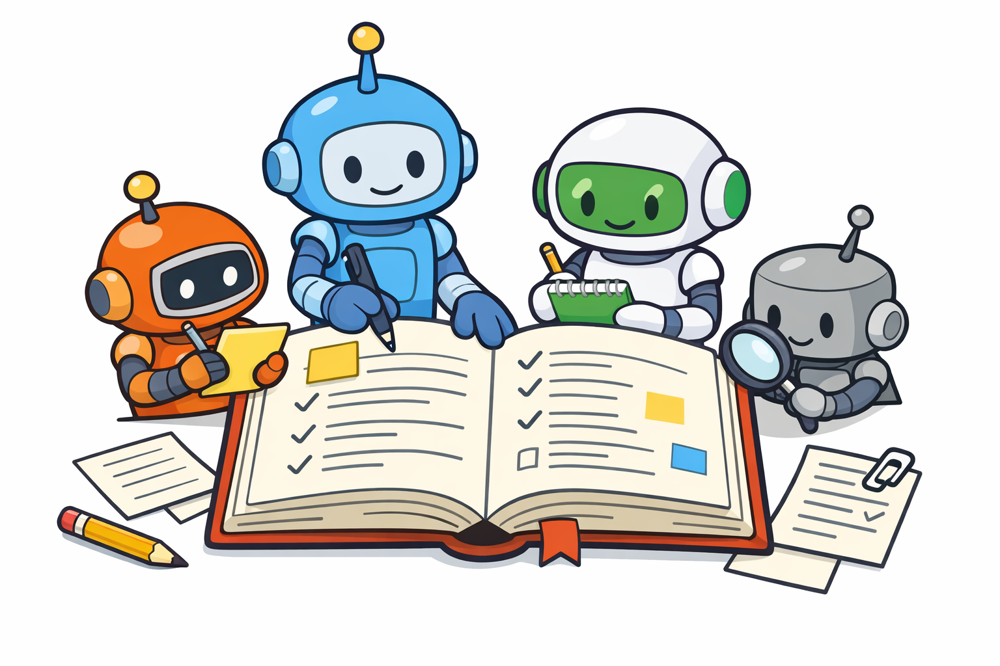

# Agent Wiki



A Claude Code plugin that maintains an auto-updating wiki for agent context about how repository components work.

## Features

- **`/agent-wiki:init`** - Initialize a new wiki by exploring the codebase with parallel sub-agents
- **`/agent-wiki:update`** - Update the wiki to reflect recent code changes
- **`/agent-wiki:reorganize`** - Analyze and restructure the wiki if needed
- **`/agent-wiki:serve`** - Start a local web server to browse the wiki

## Installation

```bash
# In Claude Code, add the GitHub repo as a marketplace
/plugin marketplace add github:anyweez/agent-wiki

# Install the plugin
/plugin install agent-wiki@anyweez/agent-wiki
```

### Install for local development

If you want to develop or modify the plugin locally:

```bash
# Clone this repository
git clone https://github.com/anyweez/agent-wiki.git
cd agent-wiki && npm install

# Option A: Run Claude Code with the plugin loaded directly
claude --plugin-dir /path/to/agent-wiki

# Option B: Add as a local marketplace for installation management
/plugin marketplace add /path/to/agent-wiki
/plugin install agent-wiki@agent-wiki-marketplace
```

## Usage

Commands are namespaced with `agent-wiki:` prefix when installed as a plugin.

### Initialize a wiki

In any repository:

```
/agent-wiki:init
```

This will:
1. Explore your codebase with parallel sub-agents
2. Identify key concepts, components, and patterns
3. Create wiki pages in the `wiki/` directory
4. Generate `llms.txt` for AI discoverability

### Update the wiki

After making code changes:

```
/agent-wiki:update
```

By default, the wiki auto-updates after agent tasks complete. Disable this in `wiki/.config.yml`:

```yaml
auto_update: false
```

### Browse the wiki

Start the local web server:

```
/agent-wiki:serve
```

Then open http://localhost:3000 in your browser.

### Reorganize

If the wiki grows unwieldy:

```
/agent-wiki:reorganize
```

This analyzes the structure and suggests/applies improvements like splitting large pages or merging small ones.

## Wiki Structure

```
wiki/
├── .config.yml       # Configuration
├── .index.json       # Page index for fast lookups
├── .last-update      # Git commit of last update
├── llms.txt          # AI-friendly index
├── llms-full.txt     # Complete content dump
├── overview.md       # Repository overview
└── [concept].md      # One page per concept
```

## Page Format

Each wiki page uses YAML frontmatter:

```markdown
---
title: Authentication System
type: concept
tags: [auth, security]
related:
  - "[[User Session]]"
  - "[[API Gateway]]"
sources:
  - src/auth/
  - src/middleware/auth.ts
---

# Authentication System

Description and documentation...

## Code References

- `src/auth/index.ts:15` - Main entry point
- `src/auth/jwt.ts:42-78` - Token validation
```

## Wikilinks

Pages are connected using `[[wikilinks]]`:

- `[[Page Name]]` - Links by title
- `[[page-name]]` - Links by slug
- `[[Page Name|display text]]` - Custom display text
- `[[subdir/page]]` - Explicit path for disambiguation

Resolution order:
1. Exact title match
2. Aliases in frontmatter
3. Slugified filename

## Configuration

Edit `wiki/.config.yml`:

```yaml
# Auto-update after tasks (default: true)
auto_update: true

# Page organization strategy
page_granularity: concept  # concept | directory | module

# Paths to exclude
exclude:
  - node_modules/
  - dist/
  - "*.min.js"

# Custom concept groupings
concepts:
  authentication:
    - src/auth/
    - src/middleware/auth*
```

## Requirements

- Python 3.8+ (for llms.txt generation)
- Node.js 16+ (for web server)
- PyYAML (`pip install pyyaml`)

## How It Works

1. **Exploration**: Sub-agents partition the codebase and explore in parallel
2. **Coordination**: A coordinator agent synthesizes findings into wiki pages
3. **Updates**: Git-based change detection identifies what needs updating
4. **Auto-trigger**: Optional hook updates wiki after task completion

## License

MIT
